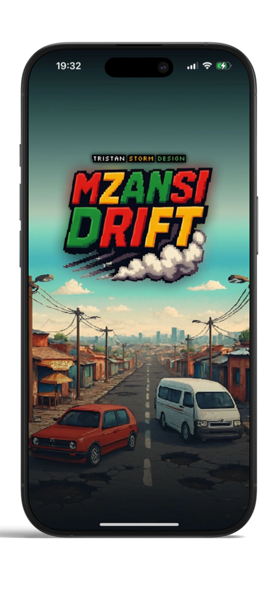

# 

# 🎮 Mzansi Drift 🚖🇿🇦

**Mzansi Drift** is a retro-styled **16-bit racing game** built with **React Native** and **Firebase**.  
Dodge potholes, collect coins, and climb the global rankings – all with a South African vibe.  
Challenge friends in multiplayer lobbies, unlock rewards, and enjoy a pixel-art nostalgic experience.

---

## 📺 Demo Video  
▶️ [Watch the YouTube Demo](https://youtube.com/your-demo-link)  

---

## ✨ Features

- **Gameplay**
  - Single Player survival mode with coins, lives, and obstacles
  - Multiplayer with QR code or room code joining
  - Smooth scrolling road synced with obstacles
  - Crash + restart mechanics

- **Account**
  - Firebase Auth (Email/Password)
  - Editable username directly on account screen
  - Country flag selector (searchable dropdown)
  - Mail label showing registered email
  - Log Out & Delete Account functionality

- **Rankings**
  - Global leaderboard with real-time Firestore sync
  - Username, country flag, score display
  - Auto-update after each game

- **Friends**
  - Add friends via QR scan or username
  - View friend list with flags and scores

- **Audio**
  - Background music with fade-in/out transitions
  - Crash sound + random taxi hoots for ambience
  - Adjustable volume sliders (music & SFX) saved with AsyncStorage

- **UI & Styling**
  - Retro **16-bit pixel art** inspired design
  - Consistent styles across all screens
  - Pixel-style icons for menu + return buttons
  - Dark theme with neon-style accents

---

## 🖼️ Screenshots

### Gameplay & Menus
<p align="center">
  
  
  
</p>
<p align="center">
  
  
  
</p>
<p align="center">
  
  
</p>

### Mockups
<p align="center">
  
  
  
</p>

---

## 🚀 Tech Stack

- **Frontend:** React Native (Expo)  
- **Backend:** Firebase (Auth, Firestore, Storage)  
- **Styling:** Pixel-art retro theme  
- **Other:** AsyncStorage, react-native-qrcode-svg, expo-av, expo-camera  

---

## ⚡ Getting Started

### Prerequisites
- [Node.js](https://nodejs.org/) (>= 18.x recommended)  
- [Expo CLI](https://docs.expo.dev/get-started/installation/)  
- Firebase project with:
  - Authentication enabled
  - Firestore enabled
  - Storage enabled  

### Installation
```bash
# Clone repo
git clone https://github.com/YOUR_USERNAME/mzansi-drift.git
cd mzansi-drift

# Install dependencies
npm install

# Start project
npx expo start

# 🔑 Firebase Setup
1. Create a new project at [Firebase Console](https://console.firebase.google.com/).  
2. Enable **Authentication** (Email/Password).  
3. Enable **Cloud Firestore**.  
4. Enable **Storage** and create a bucket.  
5. Replace your Firebase config inside `/src/firebase/firebaseConfig.ts`.  

```ts
const firebaseConfig = {
  apiKey: "XXXXXX",
  authDomain: "mzansi-drift.firebaseapp.com",
  projectId: "mzansi-drift",
  storageBucket: "mzansi-drift.appspot.com",
  messagingSenderId: "XXXXXX",
  appId: "XXXXXX"
};

# 📝 Roadmap
- [ ] Add car customization & garage upgrades  
- [ ] New obstacles and road environments  
- [ ] Daily challenges & rewards  
- [ ] Extended multiplayer modes (ranked lobbies, tournaments)  
- [ ] Social sharing (share scores/screenshots)  

---

# 🤝 Contributing
Pull requests are welcome.  

1. Fork the repo  
2. Create a feature branch (`git checkout -b feature/amazing-feature`)  
3. Commit changes (`git commit -m 'Add feature'`)  
4. Push branch (`git push origin feature/amazing-feature`)  
5. Open a Pull Request  

---

# 📜 License
This project is licensed under the **MIT License**.  
Use, modify, and distribute freely.  

---

# 👤 Author
**Tristan Storm**  
📍 South Africa 
